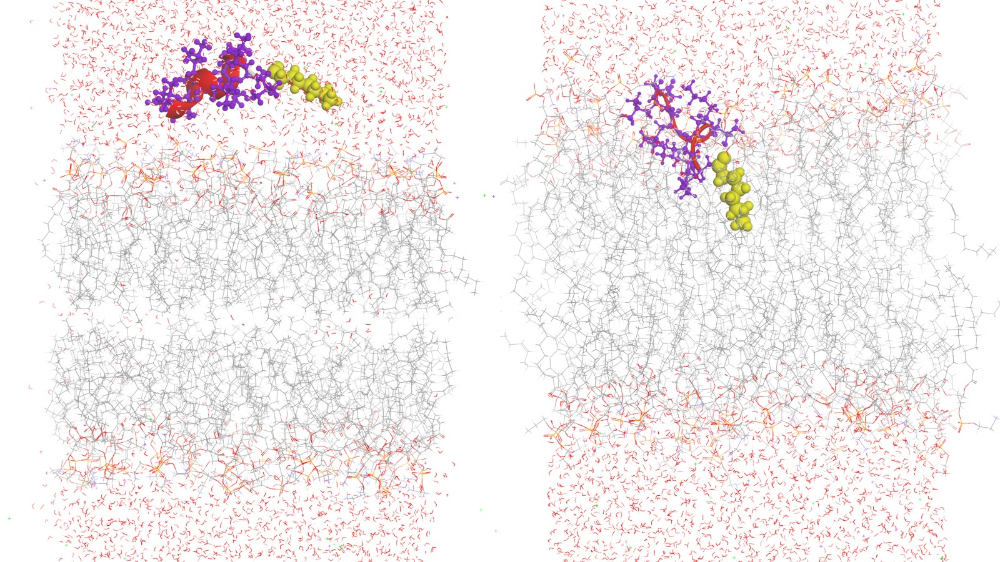

# Lipopeptide–Membrane MD with AMBER (Lipid21 + PACKMOL-Memgen)

A practical, runnable protocol to simulate an **N-acylated peptide (lipopeptide)** interacting with a **POPE:POPG (3:1)** bacterial membrane using **AmberTools/AMBER**, **Lipid21**, and **PACKMOL-Memgen**.

**Example context.** The input example files correspond to a **9-mer helical antimicrobial peptide** N-acylated with a **C8 fatty acid**. The peptide **sequence and PDB are intentionally omitted** (unpublished data), but **all other files** (fatty-acid ligand parameters, TLEaP inputs, MD control files) are provided so you can reproduce the system-building and MD pipeline with your own peptide coordinates.

**Expected behavior.** In reference runs, the lipopeptide **anchors at the headgroup region via the fatty-acid tail** and the **helical segment inserts into the bilayer** during equilibration and production. These templates are reusable for analogous lipopeptides (e.g., C8–C10 N-acyl chains) with minimal edits to `lipo/LIG.cif` and residue indices in TLEaP.

<p align="center">
  
  <br>
  <em>Pre (left): fatty-acid tail anchors at the headgroup region. Post MD (right): the helical segment inserts into the bilayer.</em>
</p>

---

## Contents

- Overview
- Requirements & environment
- Repo structure
- Commands cheat sheet (exact steps)
- Step-by-step explanation
- Detailed commands & input templates
- Analysis notes
- References
- Author

---

## Overview

We will: (1) parameterize the fatty-acid cap as a small molecule (GAFF/AM1-BCC), (2) build the peptide and form the N-acyl amide, (3) pack a POPE:POPG bilayer with PACKMOL-Memgen, (4) assemble everything in TLEaP (Lipid21 + ff14SB + TIP3P), re-solvate and add ions (neutrality and/or ~150 mM), and (5) run MD: **minimization → thermalization/heating → equilibration → production** using `min1.mdin`, `min2.mdin`, `term.mdin`, `eq.mdin`, and `md.in`.

---

## Requirements & environment

- AmberTools / AMBER (AmberTools22+ recommended; includes `packmol-memgen`)
- GPU AMBER (`pmemd.cuda`) or CPU (`pmemd` / `sander`)
- Force fields: `leaprc.protein.ff14SB`, `leaprc.lipid21`, `leaprc.water.tip3p`
- Optional modelers/editors: Chimera(X), PyMOL (Sculpting), DS Visualizer
- Bash + Python (optional helper for ion counts)

**Define AMBER install location**

Set `AMBERHOME` and add AmberTools to `PATH`:

```bash
# Linux/macOS (bash/zsh)
export AMBERHOME="/home/cluster/amber22"
export PATH="$AMBERHOME/bin:$PATH"

# Verify:
which antechamber
which tleap
```
(If your install lives elsewhere, change the path accordingly.)

---

## Repo structure

```text
.
├── lipo/                   # fatty acid (lipid cap) parametrization
│   ├── LIG.cif             # standalone fatty acid as -COOH (temporary OH)
│   ├── lig.ac              # antechamber output
│   ├── lig.prepin          # prepgen output
│   └── frcmod.lig          # parmchk2 output
├── peptide/
│   └── lipopep.pdb         # peptide + C8 fatty acid (N-acyl) starting coords
├── membrane/
│   └── system.pdb          # membrane + peptide, cleaned/merged (TLEaP INPUT)
├── tleap/
│   ├── lipopep_membrane.in # run from repo root:  tleap -f tleap/lipopep_membrane.in
│   └── leap.log
├── mdin/
│   ├── min1.mdin           # STEP 1: restrained minimization
│   ├── min2.mdin           # STEP 2: unrestrained minimization
│   ├── term.mdin           # STEP 3: thermalization / heating (NVT)
│   ├── eq.mdin             # STEP 4: equilibration (NPT)
│   └── md.in               # STEP 5: production (NPT)
├── pre-post-md.jpeg
└── README.md
```

---

## Commands cheat sheet (exact steps)

1) **Create structure (peptide + C8 fatty acid)**
   - Save peptide+lipid as `peptide/lipopep.pdb`.
   - Save the fatty acid alone (with extra –OH as carboxylic acid) as `lipo/LIG.cif`.
   # Note: de novo peptide modeling (Rosetta/AlphaFold/other) is outside the scope of this tutorial.

2) **Parametrize the fatty acid** (uses `$AMBERHOME`)
```bash
antechamber -fi ccif -i lipo/LIG.cif -bk LIG -fo ac -o lipo/lig.ac -c bcc -at amber
prepgen     -i lipo/lig.ac -o lipo/lig.prepin -m lipo/lig.mc -rn LIG
parmchk2    -i lipo/lig.prepin -f prepi -o lipo/frcmod.lig -a Y -p "$AMBERHOME/dat/leap/parm/parm10.dat"
```

3) **PACKMOL-Memgen: build membrane–peptide complex**
```bash
packmol-memgen --lipids POPE:POPG --ratio 3:1 --solute peptide/lipopep.pdb --solute_con 1 --parametrize --distxy_fix 50
# --distxy_fix sets the XY side length in Å (e.g., 50 Å per side for a ~50×50 Å patch).
```

4) **Manual clean & reposition (TLEaP-friendly input)**
   - Remove all waters/ions from the PACKMOL PDB (keep only lipids + peptide).
   - Reposition the peptide in DS Visualizer / Chimera / PyMOL and save.
   - Because viewers may reorder membrane atoms, copy **only** the peptide ATOM/HETATM
     records from the viewer-saved file back into the original membrane PDB.
   - Save as `membrane/system.pdb` (TLEaP input).

5) **TLEaP (one-liner; run from repo root)**
```bash
tleap -f tleap/lipopep_membrane.in
# Outputs: system.prmtop, system.rst7, system_solv.pdb, tleap/leap.log
```

6) **Minimization, heating, equilibration (CPU with sander)**
```bash
sander -i mdin/min1.mdin -p system.prmtop -c system.rst7     -r systemmin1.rst7 -o systemmin1.mdout -ref system.rst7
sander -i mdin/min2.mdin -p system.prmtop -c systemmin1.rst7 -r systemmin2.rst7 -o systemmin2.mdout
sander -i mdin/term.mdin -p system.prmtop -c systemmin2.rst7 -r systemterm.rst7 -o systemterm.mdout -x systemterm.nc
sander -i mdin/eq.mdin   -p system.prmtop -c systemterm.rst7 -r systemeq.rst7   -o systemeq.mdout   -x systemeq.nc
```

7) **Production**
```bash
# either your script:
sh run.xxx
# or direct with GPU:
pmemd.cuda -O -i mdin/md.in -o md.out -p system.prmtop -c systemeq.rst7 -r md.rst -x md.nc
```

---

## Step-by-step explanation (what each stage does)

1) **Fatty-acid cap parametrization (`lipo/`)**  
   The fatty acid is not covered by protein/lipid FFs, so we parametrize it as a small molecule with **GAFF/GAFF2** and **AM1-BCC** charges (Antechamber/parmchk2). Build it temporarily as **–COOH** to get stable atom types/charges; the extra O/H are removed when forming the amide.

2) **Peptide build & N-acyl bond (`peptide/`)**  
   De novo modeling of the peptide can be obtained with **Rosetta**, **AlphaFold**, or other tools and is **not part of this tutorial**.  
   Create `peptide/lipopep.pdb` with your peptide model and a **C8 fatty acid** linked via an **amide** (fatty-acid carbonyl **C** to peptide **N-terminal N**).

3) **Membrane packing + clean/reposition (`membrane/`)**  
   PACKMOL-Memgen builds a POPE:POPG (3:1) patch and places the lipopeptide.  
   Then remove waters/ions and carefully merge the peptide back into the original membrane PDB to avoid re-ordering artifacts. Result: `membrane/system.pdb` (TLEaP input).

4) **System assembly & re-solvation in TLEaP (`tleap/`)**  
   Load **Lipid21** (membrane), **ff14SB** (peptide), **TIP3P** (water), and your **ligand params** (`lipo/lig.prepin`, `lipo/frcmod.lig`). Re-solvate with `solvatebox` (TIP3P) and add ions for neutrality and/or **~150 mM**. This yields `system.prmtop`, `system.rst7`, `system_solv.pdb`.

**150 mM quick recipe (AMBER-style):**
- From `tleap/leap.log` get the box volume in ų → convert to liters: `V_L = V_ang3 × 1e-27`  
- Moles at 150 mM: `n_pairs = 0.150 × V_L`  
- Ion pairs: `N_pairs = n_pairs × 6.022e23` → round to nearest integer  
- Add equal Na⁺ and Cl⁻ **after neutrality**, e.g.:  
  `addIons prot Na+ 19 Cl- 19`

5) **MD sequence (`mdin/`)**  
   - **`min1.mdin`** — restrained minimization (relieve clashes; restrain solute heavy atoms).  
   - **`min2.mdin`** — unrestrained minimization.  
   - **`term.mdin`** — thermalization/heating (NVT to 310 K) with light restraints.  
   - **`eq.mdin`** — equilibration (NPT) at 1 atm / 310 K.  
   - **`md.in`** — production (NPT) at 310 K / 1 atm.

---

## Detailed commands & input templates

### Ligand (fatty-acid cap) parametrization
```bash
antechamber -fi ccif -i lipo/LIG.cif -bk LIG -fo ac   -o lipo/lig.ac   -c bcc -at amber
prepgen     -i lipo/lig.ac -o lipo/lig.prepin -m lipo/lig.mc   -rn LIG
parmchk2    -i lipo/lig.prepin -f prepi    -o lipo/frcmod.lig -a Y \
            -p "$AMBERHOME/dat/leap/parm/parm10.dat"
```
Note: `lipo/LIG.cif` is the standalone fatty acid in **–COOH** form (temporary O/H only for parametrization).

### TLEaP (short version using an .in file)
Run from the **repo root** (so relative paths work):
```bash
tleap -f tleap/lipopep_membrane.in
```
This generates:
```text
system.prmtop
system.rst7
system_solv.pdb
tleap/leap.log
```

**Why remove PACKMOL water and re-solvate with TLEaP?**  
PACKMOL outputs may include water/ions for packing, but we **strip them** and keep **only membrane + peptide** in `membrane/system.pdb`. Then we solvate with `solvatebox` in TLEaP because:
- TLEaP uses **pre-equilibrated TIP3P** and trims overlaps cleanly around membranes.  
- Hydration is **uniform and reproducible**.  
- Ion addition and target molarity are **controlled** after TLEaP solvation.

---

## Analysis notes

- Track **bilayer thickness, area per lipid, density**, and **leaflet balance** during equilibration.  
- Check lipopeptide **orientation/insertion**; gentle Z-axis restraints at early stages can help if starting above headgroups.  
- For long productions, segment runs (restart files) and adjust `ntpr/ntwx/ntwr` to your analysis/storage plan.  
- Consider center-of-mass removal and PBC handling during analysis (e.g., imaging lipids and peptide).

---

## References

- PACKMOL-Memgen (Amber community tutorials & paper)
- AMBER ligand (Antechamber/parmchk2) workflows
- Lipid21 (AMBER lipid force field) and usage notes
- Salt concentration calculation from `leap.log` volume (classic AMBER recipe)

---

## 👤 Author

**Ivan Sanchis, PhD**  
Laboratorio de Péptidos Bioactivos  
Facultad de Bioquímica y Ciencias Biológicas  
Universidad Nacional del Litoral  
Santa Fe, Argentina  
📧 sanchisivan@gmail.com / sanchisivan@fbcb.unl.edu.ar
